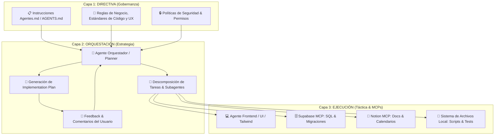

# ⚡ Antigravity PRO: Agentes Bien Estructurados & Arquitectura en 3 Capas

> **Comunidad:** Vibe Coding (Skool - IA Masters Automations)  
> **Repositorio de Referencia:** [Anthropic Skills GitHub](https://github.com/anthropics/skills) | [AAS Core Repository](https://github.com/sickn33/antigravity-awesome-skills)  
> **Catálogos en Hub:** [`Anthropic-Official-Skills-Catalogo.html`](./Anthropic-Official-Skills-Catalogo.html) | [`Agentic-Awesome-Skills-Guia-Completa.html`](./Agentic-Awesome-Skills-Guia-Completa.html)

---

## 🎯 Objetivo de la Clase

Llevar **Antigravity** al nivel profesional de ingeniería agéntica mediante:
1. **Instrucciones Estructuradas (`Instrucciones Agentes.md` / `AGENTS.md`):** Eliminar la improvisación de prompts caóticos.
2. **Arquitectura de Agentes en 3 Capas:** Separar nítidamente *Directiva*, *Orquestación* y *Ejecución*.
3. **Skills Reutilizables & Skill Creator:** Almacenar procedimientos estándar en local para no quemar tokens en razonamiento redundante y crear nuevas skills a demanda.
4. **Interacción con Sistemas Externos vía MCP:** Operar bases de datos (Supabase), gestores de conocimiento (Notion) y el sistema de archivos local de forma transparente.
5. **Cocreación Asistida:** Refinar planes de implementación mediante comentarios interactivos antes de disparar la ejecución.
6. **Paralelismo Multi-Agente:** Delegar tareas independientes a subagentes paralelos para multiplicar la productividad y reducir tiempos de espera.

---

## 🚀 Qué te Llevas de esta Clase

* **Fin a la improvisación:** Un marco de trabajo estandarizado y repetible para cualquier proyecto de software o automatización.
* **Ahorro masivo de tokens:** Almacenar instrucciones y directivas en archivos locales de configuración (`.md` / `.skill`) reduce el contexto inflado de cada prompt.
* **Control total mediante arquitectura en 3 capas:** Evitar alucinaciones y pérdidas de rumbo en flujos largos.
* **Fábrica de Skills (`Skill Creator`):** Procedimiento para que la IA investigue, estructure y empaquete nuevas habilidades operativas.
* **Automatización Real con MCPs:** Dejar de copiar y pegar JSONs o datos manualmente; la IA lee y escribe directamente en Notion, Supabase o el disco local.
* **Colaboración Humano-en-el-Bucle (HITL):** Capacidad de pausar, comentar, ajustar y autorizar planes de implementación antes de que se modifique código crítico.

---

## 🧩 Arquitectura Agéntica en 3 Capas



---

## ⚙️ Los 7 Pilares del Flujo de Trabajo PRO

### 1. Organización del Entorno Local con Antigravity
* Antigravity interactúa directamente con el sistema de archivos del sistema operativo (organizar carpetas de proyecto, descargas, documentos y assets).
* Estructura limpia de workspace:
  ```
  mi-proyecto/
  ├── .agents/
  │   ├── AGENTS.md               <-- Directivas maestras
  │   └── skills/                 <-- Skills locales del proyecto
  ├── docs/                       <-- Especificaciones y planes
  ├── src/                        <-- Código fuente modular
  └── mcp_config.json             <-- Conectores a herramientas
  ```

### 2. Inicialización de Proyectos con `Instrucciones Agentes.md`
* Se parte de una plantilla base de directivas que define roles, convenciones de nombres, linters y protocolos de comunicación.
* El agente carga estas instrucciones al inicio de la sesión, garantizando consistencia absoluta en todas las respuestas.

### 3. La Regla de Oro de las 3 Capas
* **Capa 1 (Directiva):** Define *qué* debe lograrse y *qué restricciones* existen (no tocar archivos sin permiso, usar TypeScript estricto, no meter credenciales en frontend).
* **Capa 2 (Orquestación):** Evalúa el estado del proyecto, genera el plan de acción, consulta con el usuario y divide el trabajo.
* **Capa 3 (Ejecución):** Subagentes especializados que ejecutan pasos individuales de forma atómica y reportan resultados.

### 4. Uso de Skills Reutilizables
* En lugar de escribir un prompt de 80 líneas sobre cómo diseñar un dashboard o un componente React, se invoca una skill:
  ```markdown
  "Aplica la skill frontend-design y genera el módulo de analíticas siguiendo las directivas del proyecto."
  ```
* Se aprovecha el repositorio oficial de [Anthropic Skills](./Anthropic-Official-Skills-Catalogo.html) y el ecosistema [AAS Core](./Agentic-Awesome-Skills-Guia-Completa.html).

### 5. Creación de Nuevas Skills con `Skill Creator`
* Cuando surge un flujo repetitivo (ej: conectar un webhook de Stripe, auditar un archivo CSV o generar reportes financieros):
  1. Se solicita a Antigravity investigar a fondo las mejores prácticas.
  2. Se encapsulan las reglas en un archivo `SKILL.md` estructurado con metadatos, checklist y ejemplos de código.
  3. La nueva skill queda almacenada en `.agents/skills/<nombre>/` para ser reutilizada eternamente.

### 6. Cocreación Interactiva con Planes de Implementación
* La IA propone un artefacto markdown con el plan paso a paso.
* El usuario revisa, comenta directamente sobre el plan (ajustando títulos, diseño, dependencias o endpoints) y autoriza la ejecución.
* Se evita escribir cientos de líneas de código incorrecto por falta de alineación inicial.

### 7. Integración MCP y Ejecución en Paralelo
* Conexión con MCPs externos:
  * **Notion MCP:** Creación automática de bases de datos, tareas y calendarios editoriales.
  * **Supabase MCP:** Creación de esquemas SQL, migraciones y políticas de seguridad RLS.
* Lanzamiento de subagentes en paralelo para tareas independientes (ej: mientras un agente programa el backend, otro escribe los tests unitarios y un tercero actualiza la documentación).

---

## 🧠 Consejos y Buenas Prácticas Clave

| Principio | Acción Recomendada | Error a Evitar |
| :--- | :--- | :--- |
| **Instrucciones Locales** | Guardar reglas en `AGENTS.md` o skills en local. | Copiar y pegar el mismo prompt gigante en cada chat. |
| **Arquitectura de 3 Capas** | Dejar que el orquestador planifique antes de tocar código. | Pedirle al modelo que genere todo de golpe en un solo mensaje. |
| **Revisión del Plan** | Añadir comentarios y ajustar la arquitectura antes de ejecutar. | Dar al botón de proceder a ciegas sin verificar los pasos. |
| **Uso de MCPs** | Delegar lectura y escritura directa en APIs/DBs vía MCP. | Descargar CSVs a mano y pegarlos en el chat. |
| **Paralelismo Agéntico** | Asignar tareas modulares a subagentes independientes. | Forzar una ejecución monohilo secuencial lenta. |

---

## 📂 Recursos y Enlaces Relacionados

* **🏛️ Catálogo de Skills Oficiales de Anthropic:** [`Anthropic-Official-Skills-Catalogo.html`](./Anthropic-Official-Skills-Catalogo.html) \| [`Anthropic-Official-Skills-Catalogo.md`](./Anthropic-Official-Skills-Catalogo.md)
* **🌟 Catálogo Agentic Awesome Skills (2,474+ Skills):** [`Agentic-Awesome-Skills-Guia-Completa.html`](./Agentic-Awesome-Skills-Guia-Completa.html) \| [`Agentic-Awesome-Skills-Guia-Completa.md`](./Agentic-Awesome-Skills-Guia-Completa.md)
* **🧠 Arquitectura Ecosistema IA (El Cerebro Digital):** [`Arquitectura-Ecosistema-IA-El-Cerebro-Digital.html`](./Arquitectura-Ecosistema-IA-El-Cerebro-Digital.html)
* **📦 Repositorio Anthropic Skills:** [https://github.com/anthropics/skills](https://github.com/anthropics/skills)
* **⚡ Hub Central de Recursos:** [`index.html`](./index.html) \| [`README.html`](./README.html)
