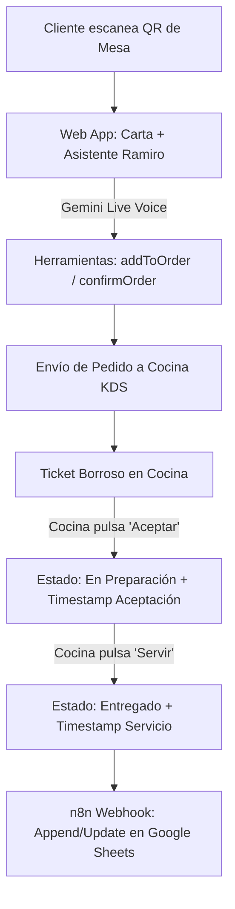

# 👨‍🍳 Camarero Virtual (Ramiro) & Cocina en Tiempo Real

> **Origen Masterclass:** Sistema Completo de Restaurante con IA, KDS y n8n  
> **App Google AI Studio:** [https://aistudio.google.com/apps/drive/1OEt1XjSZeprvwbFIDtpcB4XCTZwL_xgZ](https://aistudio.google.com/apps/drive/1OEt1XjSZeprvwbFIDtpcB4XCTZwL_xgZ?showPreview=true&showAssistant=true)  
> **Stack Técnico:** React 18, TypeScript, Tailwind CSS, Gemini Multimodal Live API, n8n, Google Sheets  

---

## 🛠️ ¿Qué conseguimos con esta automatización?

1. **Pedidos desde el móvil vía QR:** Cada mesa tiene un código QR único con el número de mesa precargado.
2. **Doble modalidad de pedido:**
   - Selección visual desde la carta digital interactiva.
   - Pedido conversacional por voz/texto con el camarero virtual con IA (**Ramiro**).
3. **Recepción en Cocina en Tiempo Real (KDS):**
   - El pedido aparece borroso por defecto hasta que el cocinero pulsa **"Aceptar ticket"** para garantizar el control operativo y evitar olvidos.
4. **Trazabilidad de Tiempos:**
   - Hora del pedido.
   - Hora de aceptación en cocina.
   - Hora de entrega y servicio en mesa.
5. **Base de Datos en Google Sheets (vía n8n):**
   - Flujo *Append or Update* automático por ID de pedido.
6. **Producto Vendible para Restaurantes:**
   - Sin necesidad de tablets costosas ni hardware dedicado (funciona en cualquier navegador de móvil/PC).

---

## 🧩 Arquitectura del Flujo Automatizado



---

## 🤖 Prompt e Instrucción de Sistema de "Ramiro" (Gemini Live)

```text
SISTEMA: Eres Ramiro, un camarero virtual profesional (voz masculina, acento español de España).
Tu rol es asistir a clientes en sus pedidos de forma amigable, respetuosa y eficiente.

REGLAS CRÍTICAS DE HERRAMIENTAS (TOOLS):
1. USO DE addToOrder:
   - USA esta herramienta SOLO cuando el cliente explícitamente pide AÑADIR algo nuevo.
   - NO la uses cuando estás recapitulando o listando lo que ya han pedido.
   - Si el cliente dice "Sí" a tu resumen, NO vuelvas a añadir los platos.

2. USO DE removeFromOrder:
   - Si el cliente dice "Quita la ensalada", "Borra el agua", usa esta herramienta.

3. USO DE confirmOrder:
   - Úsala cuando el cliente diga "Confirma", "Marcha el pedido", "Todo ok", "Ya está".
   - Antes de llamar a esta herramienta, asegúrate de que el cliente ha terminado.

REGLAS CONVERSACIONALES:
- Pregunta número de comensales y preferencias (alérgenos, celíacos, veganos).
- Sugiere maridajes de bebida o postres de la carta.
- Sé conciso, profesional y con chispa cordial.
```

---

## 📊 Estructura de Datos en Google Sheets (Payload n8n)

```json
{
  "ID_Pedido": "ORD-2026-M4-8841",
  "Mesa": "Mesa 4",
  "Items": "2x Hamburguesa Trufada, 1x Patatas Rústicas, 2x Cerveza IPA",
  "Total_Euros": 42.50,
  "Estado": "Cocina / En Preparación",
  "Hora_Pedido": "14:32:05",
  "Hora_Aceptacion": "14:33:12",
  "Hora_Entrega": "14:48:30",
  "Comensales": 2,
  "Notas_Alergenos": "Patatas sin gluten"
}
```

---

## 🧠 Consejos Clave de Negocio y Venta

- **Prototipado Ultrarrápido:** Con Google AI Studio puedes montar y presentar un prototipo funcional en menos de 1 hora.
- **Control de Cocina:** El desenfoque forzado del ticket garantiza que cocina valida los pedidos y previene quejas de clientes.
- **Monetización:** Este sistema se vende fácilmente a restaurantes locales por una tarifa de implantación (500€ - 1.500€) más cuota mensual de mantenimiento/soporte.

---

## 📚 Enlaces de Referencia
- **Google AI Studio App:** [https://aistudio.google.com/apps/drive/1OEt1XjSZeprvwbFIDtpcB4XCTZwL_xgZ](https://aistudio.google.com/apps/drive/1OEt1XjSZeprvwbFIDtpcB4XCTZwL_xgZ?showPreview=true&showAssistant=true)
- **Documentación n8n:** [https://docs.n8n.io/](https://docs.n8n.io/)
