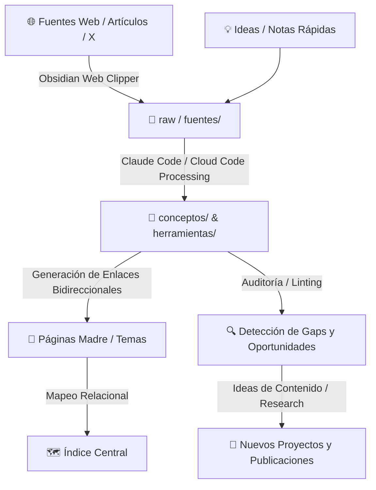

# 🧠 Obsidian + Claude Code en Acción: Tu Segundo Cerebro en Local

> **Fecha de la Clase:** 22 Abril 2026  
> **Comunidad:** Vibe Coding (Skool - IA Masters Automations)  
> **Esquema Excalidraw:** [Ver Diagrama Interactivo](https://excalidraw.com/#json=AeOdI9iaI7Fsn_smrL7Qj,JlOHSTC-jhp34a6w7dJ8Eg)  
> **Archivos del Proyecto:** [`claude-obsidian-segundo-cerebro.html`](./claude-obsidian-segundo-cerebro.html) | [`gemma4-guia-completa.html`](./gemma4-guia-completa.html)

---

## 🎯 Objetivo de la Clase

Aprender a utilizar **Claude Code / Cloud Code junto con Obsidian** para construir un **segundo cerebro en local** gobernado mediante archivos **Markdown**. 

El objetivo es superar el almacenamiento pasivo de enlaces y notas sueltas, pasando a un **sistema relacional vivo** que conecta conceptos, actualiza páginas madre y sintetiza automáticamente todo el conocimiento que vas incorporando día a día.

---

## 🚀 Qué te Llevas de esta Clase

1. **RAG Tradicional vs. Wiki Vivo:** Entender por qué un sistema que compone y relaciona conocimiento en local supera a un RAG clásico que solo devuelve fragmentos aislados.
2. **Estructura Óptima de Bóveda en Obsidian:** Organización modular en carpetas (`raw/`, `indice/`, `fuentes/`, `conceptos/`, `herramientas/`, `logs/`).
3. **Automatización con Claude Code:** Cómo usar comandos de agente para estructurar, resumir y crear enlaces bidireccionales (`[[wikilinks]]`) automáticamente.
4. **Ingesta Ágil:** Captura de artículos y contenido web con **Obsidian Web Clipper**.
5. **Detección de Gaps y Oportunidades:** Cómo auditar tu base de conocimiento para identificar temas poco cubiertos e ideas para nuevos contenidos o proyectos.
6. **Mantenimiento y Linting:** Scripts para limpiar duplicidades, erratas y enlaces rotos sin esfuerzo manual.

---

## 🧩 Arquitectura del Segundo Cerebro (Wiki Vivo)

---

## 📁 Estructura de Carpetas de la Bóveda

| Carpeta | Propósito |
| :--- | :--- |
| `raw/` o `fuentes/` | Artículos sin procesar, clips de web, transcripciones y notas en bruto. |
| `conceptos/` | Notas atómicas sobre ideas, metodologías, algoritmos y definiciones clave. |
| `herramientas/` | Fichas técnicas de software, frameworks, librerías, MCPs y modelos. |
| `indice/` | Páginas madre temáticas que agrupan y estructuran conceptos relacionados. |
| `logs/` | Registro cronológico de sesiones de procesamiento, cambios y auditorías. |

---

## ⚙️ Flujo Práctico Paso a Paso

1. **Creación de la Bóveda:** Inicialización de la carpeta local en Obsidian.
2. **Configuración de Carpetas Base:** Montaje del árbol de directorios con ayuda de Claude Code.
3. **Ingesta con Web Clipper:** Guardado de artículos y lecturas directamente en `raw/`.
4. **Procesamiento de Fuentes con Claude Code:**  
   El agente lee los archivos en `raw/`, extrae las ideas principales, crea o actualiza notas en `conceptos/` y genera los enlaces `[[nota]]` correspondientes.
5. **Ejecución del Linter:**  
   Revisión algorítmica para detectar enlaces rotos, páginas huérfanas y términos redundantes.
6. **Consulta y Generación:**  
   Interrogación al cerebro local para obtener resúmenes temáticos, ángulos de contenido y preparación de proyectos.

---

## 🧠 Ideas y Principios Clave

* **Conocimiento 100% en Local:** Soberanía total de datos en formato abierto (Markdown), sin depender de suscripciones ni servidores de terceros.
* **Componer > Solo Recuperar:** El valor real surge cuando la IA sintetiza y enriquece lo que ya sabías con cada nueva fuente que ingresas.
* **Crecimiento Orgánico:** Cada artículo o clase que añades nutre las páginas madre y amplía la red de conexiones.

---

## 📂 Recursos Disponibles

* **🌐 Presentación Interactiva Segundo Cerebro:** [`claude-obsidian-segundo-cerebro.html`](./claude-obsidian-segundo-cerebro.html)
* **🌐 Guía Completa de Gemma 4:** [`gemma4-guia-completa.html`](./gemma4-guia-completa.html)
* **🗺️ Esquema Visual Excalidraw:** [Ver Diagrama](https://excalidraw.com/#json=AeOdI9iaI7Fsn_smrL7Qj,JlOHSTC-jhp34a6w7dJ8Eg)
