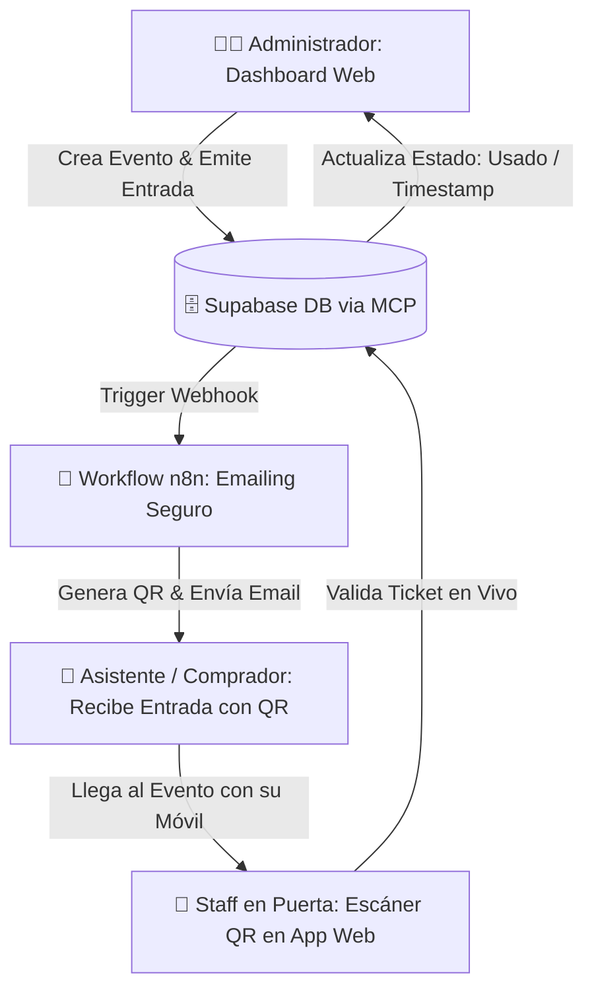

# 🎟️ De n8n a App Web en 15 Minutos: Sistema de Ticketing con Supabase & QR

> **Comunidad:** Vibe Coding (Skool - IA Masters Automations)  
> **Repositorio de Skills:** [Awesome Skills GitHub](https://github.com/sickn33/antigravity-awesome-skills)  
> **Catálogo AAS en Hub:** [`Agentic-Awesome-Skills-Guia-Completa.html`](./Agentic-Awesome-Skills-Guia-Completa.html) | [`Agentic-Awesome-Skills-Guia-Completa.md`](./Agentic-Awesome-Skills-Guia-Completa.md)

---

## 🎯 Objetivo de la Clase

Aprender a transformar un workflow de automatización técnica en **n8n** en una **aplicación web profesional completa** (Frontend React + Backend + Base de datos Supabase + Emailing transaccional + Escáner y Validación QR en tiempo real) en apenas **15 minutos** utilizando **Antigravity**, protocolo **MCP** y **skills predefinidas (App Builder)**.

---

## 🚀 Qué te Llevas de esta Clase

1. **De Automatización a Producto:** Pasar de un flujo aislado de n8n a un SaaS / dashboard visual intuitivo para usuarios finales.
2. **Sistema de Ticketing Integral:**
   - Creación y categorización de eventos y tipos de entradas.
   - Generación automática de código QR único por ticket.
   - Envío de emails automáticos con el pase QR adjunto.
   - Escáner y validación de tickets en puerta con actualización de estado en tiempo real.
3. **Aprovisionamiento Automático en Supabase:** Creación de tablas, claves foráneas, políticas RLS y tipos mediante **Supabase MCP** sin tocar la interfaz web manualmente.
4. **Seguridad y Delegación en n8n:** Evitar exponer credenciales SMTP o claves secretas en el frontend derivando el envío de correos a un webhook de n8n generado por la IA.
5. **Aceleración con Skills AAS:** Uso de la skill `App Builder` como brújula arquitectónica para definir UX, lógica de negocio y esquemas de base de datos.

---

## 🧩 Arquitectura del Sistema de Ticketing

---

## ⚙️ El Flujo de Construcción en 5 Pasos

### 1. Preparación y Referencias
* Se importan los archivos HTML del sistema previo y el archivo `.json` del workflow de n8n en el workspace.
* Se activa la skill especializada **`App Builder`** (disponible en el catálogo [AAS Core](./Agentic-Awesome-Skills-Guia-Completa.html)).

### 2. Prompt Maestro con Plan de Implementación
Se solicita a Antigravity:
1. Analizar el workflow de n8n y los recursos previos.
2. Conectarse a **Supabase vía MCP** y diseñar el esquema de tablas (`events`, `tickets`, `attendees`, `checkins`).
3. Presentar un plan de implementación detallado antes de escribir código.

### 3. Aprovisionamiento y Desarrollo Autónomo
* Antigravity ejecuta las migraciones SQL en Supabase de forma desatendida.
* Construye el frontend React con Tailwind: panel de eventos, listado de asistentes, generador de QR y lector con cámara web para validación en puerta.

### 4. Flujo de Emailing Seguro con n8n
* Para no almacenar credenciales de correo (Resend, SendGrid, Gmail) en el cliente web, Antigravity genera el JSON del workflow de n8n.
* Se pega en n8n y se activa como webhook de notificación instantánea.

### 5. Validación y Pruebas en Vivo
* Emisión de ticket de prueba ➔ Recepción de email con QR ➔ Escaneo con la cámara ➔ Validación y bloqueo antirreutilización en Supabase.

---

## 🧠 Principios y Consejos Clave

* **Pensar en Producto, no solo en Script:** La diferencia entre una automatización invisible y un proyecto vendible es una interfaz limpia que cualquier empleado o cliente pueda usar.
* **Las Skills Estructuran la IA:** Una skill como `App Builder` evita que el modelo improvise arquitecturas débiles y fuerza estándares de diseño y tipado estricto.
* **Separación de Responsabilidades:** La web gestiona la experiencia visual y la validación en puerta; n8n gestiona los procesos asíncronos y envíos de correo seguros.

---

## 📂 Recursos Disponibles

* **📦 Repositorio Awesome Skills:** [https://github.com/sickn33/antigravity-awesome-skills](https://github.com/sickn33/antigravity-awesome-skills)
* **🌟 Catálogo Completo AAS (2,474+ Skills):** [`Agentic-Awesome-Skills-Guia-Completa.html`](./Agentic-Awesome-Skills-Guia-Completa.html)
* **🏛️ Catálogo de Skills Oficiales de Anthropic:** [`Anthropic-Official-Skills-Catalogo.html`](./Anthropic-Official-Skills-Catalogo.html)
