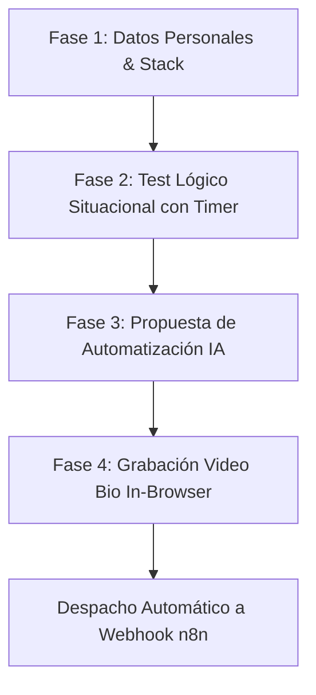

# ⚡ FYZON Recruitment - n8n Specialist (Google AI Studio App)

> **Origen:** [Google AI Studio Drive App](https://aistudio.google.com/apps/drive/15JQf9xwEKqhqY_iaiIL0g1Fxgxq-0qj2?showPreview=true&showAssistant=true)  
> **Drive ID:** `15JQf9xwEKqhqY_iaiIL0g1Fxgxq-0qj2`  
> **Tecnología:** React 18, TypeScript, Tailwind CSS, MediaRecorder API (Webcam/Mic), Lucide React, n8n Webhook  

---

## 1. Descripción y Propósito

**FYZON Recruitment - n8n Specialist** es una plataforma interactiva de triaje y reclutamiento técnico diseñada para evaluar y filtrar especialistas en automatizaciones con **n8n** y flujos de Inteligencia Artificial.

Integra un embudo de 4 fases que recopila información profesional, evalúa el juicio situacional y técnico mediante un test interactivo con temporizador, solicita una propuesta arquitectónica creativa y graba un video-pitch de 60 segundos directamente en el navegador antes de enviar los datos a un webhook de n8n.

---

## 2. Las 4 Fases del Embudo



1. **Fase 1: Perfil & Stack Técnico:** Captura de datos de contacto, ubicación, experiencia con n8n, fortalezas y expectativas salariales.
2. **Fase 2: Situational Judgment Test (SJT):** 4 preguntas de juicio situacional con temporizador de 45 segundos y cálculo automático de puntuación.
3. **Fase 3: Desafío Creativo:** Redacción de una automatización disruptiva de reclutamiento con IA (mínimo 20 caracteres).
4. **Fase 4: Video Bio In-Browser:** Grabación de video y audio con cuenta atrás, vista previa interactiva y codificación en Base64/Blob.

---

## 3. Preguntas del Test Lógico de Arquitectura (n8n)

### Escenario 1: Prisa Crítica vs Deuda Técnica
- **Pregunta:** *Un cliente pide una automatización urgente para 'ayer', pero sabes que la forma rápida causará errores en un mes. ¿Qué haces?*
- **Respuesta Correcta:** *Implemento un MVP robusto que cumpla lo urgente y programo refactorización técnica documentada.* (Equilibrio pragmatismo/calidad).

### Escenario 2: Fallo Silencioso
- **Pregunta:** *Tu workflow crítico falla silenciosamente un domingo a las 3 AM. No hay logs de error. ¿Tu primera acción?*
- **Respuesta Correcta:** *Implemento inmediatamente un sistema de Log/Try-Catch para cazarlo.*

### Escenario 3: Adopción de Funcionalidades Beta
- **Pregunta:** *n8n lanza una funcionalidad Beta (ej. Agentes IA) que podría ahorrarle 10h a tu cliente, pero puede ser inestable.*
- **Respuesta Correcta:** *Monto un entorno de pruebas paralelo y mido resultados.*

### Escenario 4: Oportunidad de Optimización
- **Pregunta:** *Descubres que la lógica que te pidió el Project Manager es redundante y se puede hacer con 2 nodos en vez de 10.*
- **Respuesta Correcta:** *Propongo la mejora con una demo rápida demostrando la eficiencia.*

---

## 4. Payload Estructurado hacia Webhook de n8n

```json
{
  "candidate_profile": {
    "fullName": "Candidato Ejemplo",
    "email": "candidato@email.com",
    "phone": "+34 600 000 000",
    "location": "Madrid, España",
    "hasN8nExperience": "Sí",
    "techStack": "n8n, Python, PostgreSQL, OpenAI, Supabase",
    "salaryExpectations": "35.000€ - 45.000€"
  },
  "evaluation_results": {
    "logicScore": 100,
    "logicWrittenAnswer": "Implementaría un agente de triaje autónomo con n8n...",
    "videoBioUploaded": true,
    "submissionTimestamp": "2026-09-27T18:35:00Z"
  }
}
```

---

## 📚 Enlaces y Recursos
- **Google AI Studio App:** [https://aistudio.google.com/apps/drive/15JQf9xwEKqhqY_iaiIL0g1Fxgxq-0qj2](https://aistudio.google.com/apps/drive/15JQf9xwEKqhqY_iaiIL0g1Fxgxq-0qj2?showPreview=true&showAssistant=true)
- **Documentación n8n:** [https://docs.n8n.io/](https://docs.n8n.io/)
