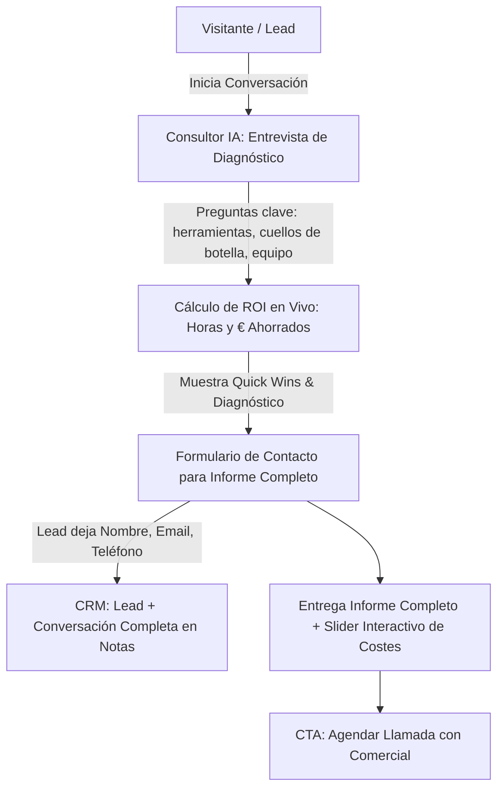

# 👨‍💻 Forja-Consultor: Crea los Mejores Lead Magnet con IA

> **Fecha de la Clase:** 23 Julio 2026  
> **Comunidad:** Vibe Coding (Skool - IA Masters Automations)  
> **Grabación:** [Café Camaleónico - Consultorio IA en Skool](https://www.skool.com/ia-masters-automations/classroom/56b4a809?md=b8fd721e88b24e5b8a5a642159380182)  
> **Archivos del Proyecto:** [`forja-consultor.skill`](./forja-consultor.skill) | [`solutechia-consultant 2.zip`](./solutechia-consultant%202.zip) | [`forja-consultor-explicacion.html`](./forja-consultor-explicacion.html)

---

## 🎯 Objetivo de la Clase

Esta clase es la continuación directa del Café Camaleónico *"Consultorio de Inteligencia Artificial"*. En ella se analiza el **caso de éxito real de Solutech IA**: un consultor conversacional con IA que entrevista a un lead, le genera un informe de automatización a medida con cálculo de ROI en vivo, y envía todos los datos al CRM comercial para el seguimiento.

El gran valor de esta sesión es transformar este patrón en una **meta-skill (`/forja-consultor`)**: una fábrica que te entrevista sobre tu negocio (o el de tus clientes en modo agencia), genera el consultor conversacional a medida y lo deja listo para desplegar en tu propio Vercel.

---

## 🚀 Qué te llevas de esta Clase

1. **Consultor Conversacional con IA:** Cómo funciona la entrevista interactiva que diagnostica los cuellos de botella del lead y le genera un informe personalizado.
2. **Cálculo de ROI en Vivo (Horas y Euros):** Cómo traducir horas perdidas en coste anual tangible (ej. 8h/semana = 12.384€/año) para evidenciar el valor del servicio de inmediato.
3. **Captura Ética de Datos tras Aportar Valor:** Solicitar nombre, email y teléfono **después** de entregar el diagnóstico previo, reduciendo al mínimo la fricción.
4. **Sincronización Total con CRM:** Cómo enviar la conversación completa como notas de contexto del lead hacia el CRM comercial.
5. **Adaptabilidad Multisectorial:** Cómo trasladar la misma lógica a sectores completamente diferentes (ej. clínica de injertos capilares con simulación de imagen antes/después a 3, 6 y 12 meses).
6. **Meta-Skill `/forja-consultor`:** Cómo una skill genera otra skill a medida mediante una entrevista asistida por IA.

---

## 🧩 Estructura y Demos de la Sesión

### 1. Demo 1: Solutech IA (Agencia de Marketing)
* **Lead de prueba:** "Ernesto", agencia de marketing digital con 15 personas.
* **Diagnóstico IA:** Pregunta por herramientas (Google Workspace, Meta Ads), fuentes de clientes y tareas repetitivas (informes semanales manuales en Sheets).
* **Informe y ROI:**
  - Estimación de ahorro: **8h/semana ➔ 12.384€ al año** (78% potencial de automatización, 39.000€ a 3 años).
  - Slider interactivo para ajustar el coste/hora del equipo y recalcular en tiempo real.
  - Quick wins: extracción automatizada de Meta Ads, comparativas automáticas y exportación de plantillas.
  - Cierre con botón para agendar reunión con el equipo comercial.

### 2. Demo 2: Clínica de Injertos Capilares (Lead Magnet Visual)
* La skill analiza la web y propone lead magnets sectoriales.
* **Lead Magnet elegido:** *"¿Cuántos injertos capilares necesitas?"*
* El usuario sube una foto y responde datos (edad, tiempo de caída, antecedentes).
* La IA genera diagnóstico orientativo, rango de unidades foliculares y simulación visual del resultado a los 3, 6 y 12 meses.
* Captura de contacto previa a la simulación detallada y llamada a agendar cita médica.

### 3. La Meta-Skill: `/forja-consultor`
* **Definición:** Una skill que crea otra skill personalizada a través de una entrevista.
* **Funcionamiento:**
  1. Ejecutas `/forja-consultor` en Antigravity / Claude Code.
  2. Respondes a la entrevista sobre tu negocio (qué ofreces, qué regalas, cómo captas hoy).
  3. Verifica e instala dependencias requeridas.
  4. Genera la aplicación React lista para desplegar en tu cuenta de Vercel.
* **Modelos de uso:** Negocio propio o modo agencia para vender consultores a múltiples clientes.

---

## 🧠 Aprendizajes Clave

* **Un Lead Magnet Moderno es una Experiencia:** Deja atrás el PDF estático; una conversación diagnóstica aporta 10x más valor percibido.
* **El ROI en Números Cierra Ventas:** Convertir horas en euros ahorrados hace irresistible la propuesta de automatización.
* **Contexto Completo en el CRM:** El comercial entra a la llamada sabiendo exactamente las herramientas, problemas y objetivos del cliente.

---

## 🛠️ Recursos Incluidos en el Repositorio

* **Guía Visual e Interactiva:** [`forja-consultor-explicacion.html`](./forja-consultor-explicacion.html)
* **Paquete de Meta-Skill:** [`forja-consultor.skill`](./forja-consultor.skill)
* **Código Fuente Completo Solutech IA:** [`solutechia-consultant 2.zip`](./solutechia-consultant%202.zip)
* **Acceso en Skool:** [Ver Grabación en Skool](https://www.skool.com/ia-masters-automations/classroom/56b4a809?md=b8fd721e88b24e5b8a5a642159380182)
