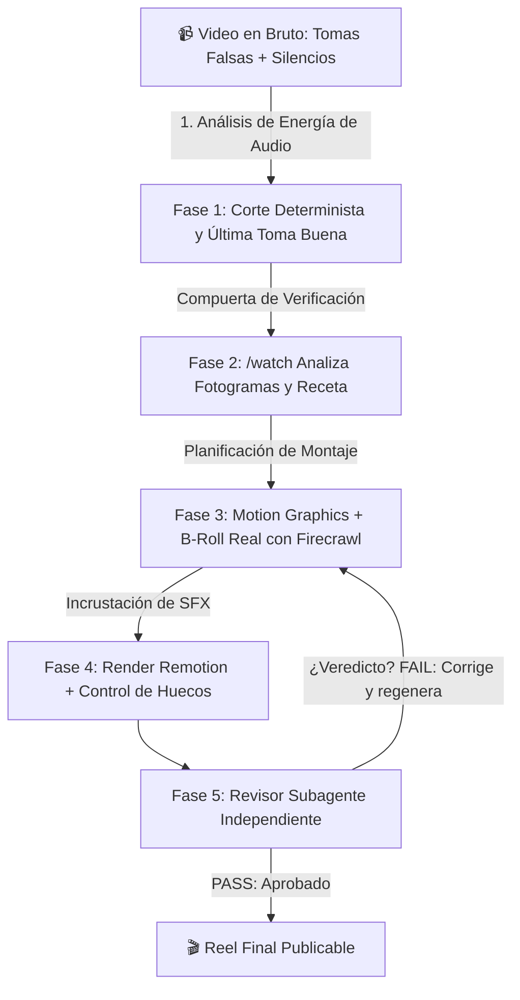

# 👨‍💻 Monta tu Editor de Videos con IA (Forja Reel)

> **Fecha de la Clase:** 30 Junio 2026  
> **Comunidad:** Vibe Coding (Skool - IA Masters Automations)  
> **Grabación en Skool:** [Monta tu Editor de Videos con IA](https://www.skool.com/ia-masters-automations/classroom/b5848fd4?md=c7e93f2569704765a55647f015994ea8)  
> **Archivos del Proyecto:** [`forja-reel.skill`](./forja-reel.skill) | [`forja-reel-explicacion.html`](./forja-reel-explicacion.html) | [`reel-edita-explicacion.html`](./reel-edita-explicacion.html)

---

## 🎯 Objetivo de la Clase

Explicar y estructurar por dentro **Forja Reel**: el sistema automatizado con el que, a partir de una grabación en bruto del tirón (con silencios, tomas falsas, repeticiones y errores), **Claude Code y Antigravity** producen un **reel profesional** —con corte fino, motion graphics, B-roll real, subtítulos dinámicos y SFX— sin necesidad de abrir un editor manual como Premiere o CapCut.

Al finalizar la sesión, se entrega la **meta-skill (`/forja-reel`)** que te hace una entrevista en 8 bloques para construir **tu propio editor personalizado** con tu branding, ritmo y estilo.

---

## 🚀 Qué te Llevas de esta Clase

1. **El Motor Completo de Edición en 5 Fases:** Flujo algorítmico y compuertas de calidad automáticas para garantizar que el resultado no parezca generado por IA.
2. **Meta-Skill para Crear tu Propio Editor:** Entrevista de 8 bloques sobre tus colores de marca, encuadre en pantalla, ritmo de cortes, estilo de B-roll, subtitulado y *cold open*.
3. **El Stack Técnico Exacto:**
   - **Obligatorio:** `FFmpeg`, `Remotion`, `Hyperframes`.
   - **Opcional / Aceleradores:** `Groq` (transcripción Whisper ultrarrápida), `fal` (generación visual), `Firecrawl MCP` (captura de B-roll real de webs) y la skill `/watch`.

---

## 🧩 Las 5 Fases del Motor de Edición

### 1. Corte Determinista
Analiza el audio por energía de decibelios para recortar silencios, titubeos y repeticiones, seleccionando siempre la **última toma válida**. Una compuerta algorítmica valida que no existan cortes abruptos de palabras.

### 2. Lectura y Propuesta de Tratamiento (`/watch`)
Mediante la skill `/watch`, el agente inspecciona el video fotograma a fotograma para determinar el tono y la "receta" visual ideal (un anuncio comercial no se edita igual que una noticia técnica).

### 3. Motion Graphics y B-Roll Real
Genera gráficos y animaciones usando **Hyperframes**. En lugar de recursos genéricos de stock, utiliza **Firecrawl MCP** para extraer capturas en vivo de webs, repositorios de GitHub o noticias reales.

### 4. SFX, Render y Control de Calidad
Añade efectos de sonido tácticos (pops, whooshes, risers), renderiza la composición mediante **Remotion CLI** y ejecuta un análisis de colisiones para evitar solapamientos.

### 5. Revisor Subagente Independiente (Loop PASS/FAIL)
Un subagente desacoplado inspecciona el video terminado con `/watch`. Si detecta fallos de ritmo, textos cortados o desincronización, devuelve `FAIL` con instrucciones precisas para que el agente principal lo corrija antes de dar el `PASS` definitivo.

---

## 🧠 Ideas y Principios Clave

* **Especificación Primero, Código Después:** Se planifica la estructura y el ritmo antes de ensamblar el render (metodología *Spec Kit*).
* **Regla de los 4 Segundos:** Ningún plano debe superar los 4 segundos sin un cambio visual, zoom o elemento gráfico que reactive la atención.
* **B-Roll Real > B-Roll de Stock:** Capturar la web o el código real aporta 10x más autoridad y autenticidad.
* **Adiós a los Clichés de IA:** Elimina fórmulas gastadas como *"¿Alguna vez te has preguntado...?"*, subtítulos de emojis flotantes excesivos y tipografías predecibles.
* **Eficiencia Total:** Grabarse en 15 minutos y tener el reel terminado en otros 15 minutos.

---

## 📂 Recursos de la Clase

* **🌐 Presentación Interactiva Forja Reel:** [`forja-reel-explicacion.html`](./forja-reel-explicacion.html)
* **🌐 Guía del Editor de Video:** [`reel-edita-explicacion.html`](./reel-edita-explicacion.html)
* **📦 Meta-Skill Forja Reel:** [`forja-reel.skill`](./forja-reel.skill)
* **🎥 Grabación en Skool:** [Ver Clase en Skool](https://www.skool.com/ia-masters-automations/classroom/b5848fd4?md=c7e93f2569704765a55647f015994ea8)
