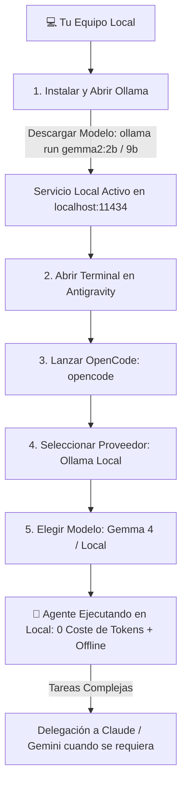

# 🤖 IA en Local Para tus Agentes: GEMMA 4 + Ollama

> **Comunidad:** Vibe Coding (Skool - IA Masters Automations)  
> **Archivos del Proyecto:** [`gemma4-guia-completa.html`](./gemma4-guia-completa.html) | [`claude-obsidian-segundo-cerebro.html`](./claude-obsidian-segundo-cerebro.html)

---

## 🎯 Objetivo de la Clase

Aprender a ejecutar y orquestar modelos de inteligencia artificial en local mediante **GEMMA 4 y Ollama**, seleccionando la versión óptima según la memoria RAM de tu equipo e integrándola directamente en sistemas agénticos como **Antigravity, OpenCode y Claude Code (vía MCP)**.

Esta arquitectura permite **ahorrar miles de tokens** en APIs premium (Claude Sonnet, GPT-4, Gemini Pro), trabajar **100% offline** y garantizar la **privacidad total** de datos sensibles.

---

## 🚀 Qué te Llevas de esta Clase

1. **Comprensión de GEMMA 4:** Por qué los modelos pequeños de nueva generación compiten con arquitecturas mucho más pesadas gracias a su eficiencia de entrenamiento y arquitectura.
2. **Dimensionamiento por RAM:** Guía clara para elegir qué modelo descargar según tu hardware.
3. **Instalación Rápida con Ollama:** Configuración de modelos locales desde interfaz gráfica y terminal.
4. **Integración Agéntica:**
   - **Antigravity & OpenCode:** Configuración del proveedor Ollama local para ejecutar prompts y scripts.
   - **Claude Code:** Conexión mediante **MCP local de Ollama** para delegación de subtareas.
5. **Estrategia Híbrida de Ahorro de Tokens:** Delegar tareas mecánicas (clasificación, extracción de entidades, formateo JSON, redacción básica) al modelo local mientras reservas modelos frontera para razonamiento complejo y arquitectura.
6. **Evaluación de Rendimiento en VPS vs Local:** Por qué la ejecución en tu propia máquina suele ser más rentable y rápida que en VPS modestos.

---

## 📊 Tabla de Dimensionamiento de Hardware (RAM)

| Modelo GEMMA | RAM Mínima Recomendada | Caso de Uso Ideal | Velocidad Relativa |
| :--- | :--- | :--- | :--- |
| **Gemma 2B / 4B** | 8 GB - 16 GB | Clasificación, extracción de datos, linter, resúmenes rápidos y redacción corta. *(Recomendado para la mayoría)* | ⚡⚡⚡ Ultrarrápido |
| **Gemma 9B** | 16 GB - 24 GB | Generación de código intermedio, razonamiento estructurado, agentes conversacionales. | ⚡⚡ Rápido |
| **Gemma 27B** | 32 GB - 64 GB+ | Razonamiento avanzado, refactorización profunda, traducción técnica de alta fidelidad. | ⚡ Moderado |

---

## ⚙️ Flujo de Integración en Antigravity & OpenCode



---

## 🔄 Estrategia Híbrida: Ahorro Inteligente de Tokens

```
[📥 Entrada de Tareas del Proyecto]
          │
          ├───► ¿Es tarea simple / mecánica? (Formateo, Extracción, Resumen)
          │         └───► 🤖 GEMMA 4 Local (0€ / Ilimitado / Privado)
          │
          └───► ¿Es arquitectura / refactorización compleja?
                    └───► 🧠 Claude 3.7 Sonnet / Gemini 2.0 Flash (API)
```

---

## 🧠 Ideas y Principios Clave

* **No mates moscas a cañonazos:** El 60-70% de las tareas de un pipeline automatizado son transformaciones simples que un modelo 4B resuelve de forma impecable sin gastar saldo de API.
* **Privacidad Absoluta:** Ideal para procesar contratos, bases de datos de clientes o información confidencial que no debe salir de la red local.
* **Carga Inicial:** La primera inferencia requiere unos segundos adicionales mientras los pesos se cargan en la VRAM/RAM unificada.

---

## 📂 Recursos Disponibles

* **🌐 Guía Completa Interactiva de Gemma 4:** [`gemma4-guia-completa.html`](./gemma4-guia-completa.html)
* **🧠 Guía del Segundo Cerebro Local:** [`Claude-Obsidian-Segundo-Cerebro-Guia.md`](./Claude-Obsidian-Segundo-Cerebro-Guia.md)
* **📦 Web Oficial Ollama:** [https://ollama.com/](https://ollama.com/)
