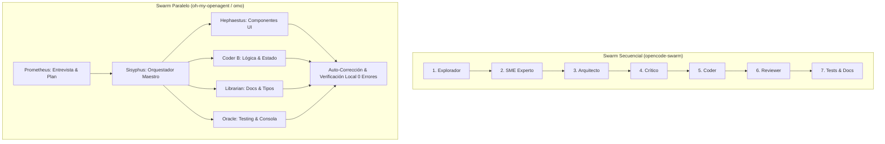

# 🐝 Swarm Avanzado en OpenCode: Guía Maestra de oh-my-openagent (`omo`)

> **Comunidad:** Vibe Coding (Skool - IA Masters Automations)  
> **Documentación Oficial:** [Guía para la Comunidad en Notion](https://www.notion.so/oh-my-openagent-omo-Gu-a-para-la-Comunidad-3262cd2e5d1581ea8becd77ce7e33064)  
> **Repositorio Swarm Secuencial:** [https://github.com/zaxbysauce/opencode-swarm](https://github.com/zaxbysauce/opencode-swarm)  
> **Archivos Locales:** `Swarm secuencial.textClipping` | `Documentacion Swarm.textClipping`

---

## 🎯 Objetivo de la Clase

Aprender a orquestar y construir proyectos de software completos de principio a fin utilizando **OpenCode Swarm con `oh-my-openagent` (`omo`)** (con más de 40.000 ⭐ en GitHub).

El objetivo es superar el paradigma de interactuar con una sola IA aislada y pasar a un **equipo coordinado de 7 agentes especializados** que trabajan en paralelo, se auto-corrigen, ejecutan pruebas en local y entregan proyectos complejos (como una landing page profesional con 10 secciones, blog y políticas) con **cero errores en consola** y sin intervención manual paso a paso.

---

## 🚀 Qué te Llevas de esta Clase

1. **Swarm Secuencial vs. Swarm Paralelo:** Cuándo usar pipelines por etapas lineales (`opencode-swarm`) y cuándo desplegar swarms concurrentes (`omo`).
2. **Equipo de 7 Agentes Especializados:** Liderados por **Sisyphus** (el orquestador principal) junto a **Prometheus**, **Hephaestus**, **Oracle**, **Librarian**, **Explore** y agentes de testing.
3. **Entrevista Previa con Prometheus:** Cómo extraer todos los requisitos y arquitectura antes de escribir una sola línea de código.
4. **Modo `ultrawork`:** Automatización autónoma total: *"lo enciendes y te vas a hacer un café"*.
5. **Enrutamiento Inteligente de Modelos (Ahorro de Costes):**
   - **Modelos de Pago / Frontera (Claude Opus / 3.7 Sonnet, GPT-5.3 Codex):** Asignados a *Sisyphus*, *Hephaestus* y *Prometheus*.
   - **Modelos Gratuitos / Rápidos (Big Pickle, GPT Nano, Gemini Flash):** Asignados a *Oracle*, *Librarian* y *Explore*.
6. **Aislamiento de Archivos:** Prevención de colisiones y conflictos git al reservar zonas de archivos exclusivas para cada agente.

---

## 🧩 Comparativa: Swarm Secuencial vs. Swarm Paralelo



---

## ⚙️ Configuración y Asignación de Modelos (`.opencode/oh-my-opencode.jsonc`)

Puedes personalizar los modelos asignados a cada agente para maximizar calidad y reducir consumo de créditos:

```jsonc
{
  "orchestrator": {
    "agent": "sisyphus",
    "model": "claude-3-7-sonnet" // O claude-opus / gpt-5-codex
  },
  "planner": {
    "agent": "prometheus",
    "model": "claude-3-7-sonnet"
  },
  "builder": {
    "agent": "hephaestus",
    "model": "claude-3-7-sonnet"
  },
  "researchers": {
    "agent": "oracle",
    "model": "gemini-2.0-flash" // O modelos gratuitos de OpenCode Zen
  },
  "documentation": {
    "agent": "librarian",
    "model": "big-pickle" // Gratuito
  }
}
```

---

## 🎮 Los 3 Modos de Operación

| Modo | Comando / Activación | Cuándo Utilizarlo |
| :--- | :--- | :--- |
| **Prometheus + `/start-work`** | Inicia con entrevista interactiva | **Recomendado para proyectos nuevos.** Extrae requisitos profundos, define diseño y genera el plan antes de codificar. |
| **`ultrawork`** | Comando de máxima velocidad autónoma | Ideal cuando la especificación ya está clara y priorizas velocidad de ejecución desatendida. |
| **Lenguaje Natural Directo** | Prompt específico a Sisyphus | Tareas puntuales, refactorizaciones concretas o adición de módulos aislados. |

---

## 🧠 Ideas y Aprendizajes Clave

* **La entrevista previa de Prometheus marca la diferencia:** Invertir 5 minutos respondiendo a las preguntas de Prometheus multiplica la precisión del resultado final.
* **Tolerancia a Fallos y Cambio en Caliente:** Si te quedas sin créditos en un proveedor (Anthropic), puedes cambiar el modelo del agente a OpenAI o Gemini en el archivo de configuración sin perder el estado ni reiniciar el proyecto.
* **Autonomía con Cero Errores:** Los agentes ejecutan el servidor de desarrollo, leen los logs de la terminal, corrigen advertencias y entregan el proyecto probado en local.

---

## 📂 Recursos Disponibles

* **📘 Guía Oficial de la Comunidad:** [Ver en Notion](https://www.notion.so/oh-my-openagent-omo-Gu-a-para-la-Comunidad-3262cd2e5d1581ea8becd77ce7e33064)
* **📦 Repositorio Swarm Secuencial:** [https://github.com/zaxbysauce/opencode-swarm](https://github.com/zaxbysauce/opencode-swarm)
* **📄 Recortes Locales:** `Swarm secuencial.textClipping` | `Documentacion Swarm.textClipping`
