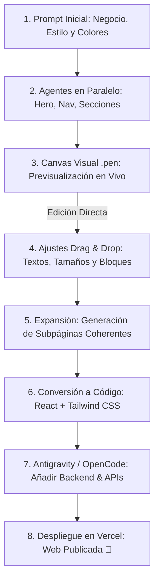

# ✏️ Pencil: Frontend Automático con IA (Canvas `.pen` + React & Tailwind)

> **Comunidad:** Vibe Coding (Skool - IA Masters Automations)  
> **Documentación Oficial en Notion:** [Descubre Pencil: La Revolución en Creación de Frontend](https://www.notion.so/Descubre-Pencil-La-Revoluci-n-en-Creaci-n-de-Frontend-3182cd2e5d15809c8acbeee9593df856?source=copy_link)  
> **Sitio Web Oficial:** [https://www.pencil.dev/](https://www.pencil.dev/)  
> **Integración MCP:** Protocolo Pencil MCP con Antigravity y OpenCode

---

## 🎯 Objetivo de la Clase

Aprender a utilizar **Pencil (`pencil.dev`)**, la plataforma de diseño frontend impulsada por IA que combina la **generación autónoma mediante agentes en paralelo** con la **edición visual directa sobre un canvas tipo Figma/Canva** (formato `.pen`).

El objetivo principal es construir el frontend completo de páginas web, landings o dashboards en cuestión de minutos, ajustar detalles visualmente mediante *drag & drop* sin necesidad de re-promptear a la IA, y convertir el diseño final en código limpio y modular en **React + Tailwind CSS** listo para desplegar en plataformas como **Vercel** o conectar a backend en **Antigravity**.

---

## 🚀 Qué te Llevas de esta Clase

1. **Generación con Agentes en Paralelo:** Cómo Pencil asigna múltiples agentes simultáneos para diseñar el Hero, la barra de navegación, las secciones de contenido y el footer al mismo tiempo bajo la supervisión de un agente orquestador.
2. **Edición Híbrida (IA + Canvas Manual):** Modificar textos, paletas de colores, espaciados y posiciones directamente en el canvas visual sin consumir tokens ni reescribir prompts.
3. **Consistencia Visual Multi-Página:** Crear subpáginas (Catálogo de productos, Reservas, Sobre nosotros) manteniendo automáticamente la misma línea gráfica y tokens de diseño.
4. **Exportación a Código Real (React + Tailwind):** Transformación del archivo de diseño `.pen` en componentes React limpios, responsivos y con animaciones modernas.
5. **Integración con Ecosistema Agéntico:** Conexión vía **Pencil MCP** con **Antigravity** y **OpenCode** para añadir lógica de backend, bases de datos (Supabase) y automatizaciones (n8n).
6. **Despliegue a Producción:** Publicación inmediata en **Vercel** con un solo comando o clic.

---

## 🧩 Flujo de Trabajo: De Prompt a Producción en 9 Pasos

---

## ⚙️ Las 9 Fases del Pipeline de Pencil

| Fase | Acción | Beneficio Clave |
| :--- | :--- | :--- |
| **1. Instalación** | Descarga e instalación de Pencil Desktop | Entorno local ultrarrápido sin latencia de navegador. |
| **2. Conexión de Modelos** | Inicio de sesión con Anthropic (Claude Opus/Sonnet), OpenAI (Codex/GPT) o MCP | Flexibilidad para elegir el modelo con mejor criterio estético. |
| **3. Prompt Inicial** | Definición de identidad de marca, paleta y objetivos | Genera la base estructural con una sola instrucción. |
| **4. Agentes en Paralelo** | Construcción concurrente de módulos | Reduce el tiempo de generación a segundos. |
| **5. Edición Visual** | Selección y edición drag & drop en el canvas | Control total de microdetalles sin fricción. |
| **6. Páginas Secundarias** | Creación de catálogo, blog, checkout o contacto | Hereda tokens de diseño y tipografías existentes. |
| **7. Exportación a Código** | Compilación a componentes React + Tailwind | Código listo para producción sin dependencias propietarias. |
| **8. Desarrollo en Antigravity** | Integración de bases de datos, APIs y lógica | Conversión de UI estática en aplicación funcional. |
| **9. Despliegue Vercel** | Conexión git y despliegue CI/CD | Lanzamiento global en servidor edge de alta velocidad. |

---

## 🧠 Ideas y Consejos Clave

* **El Flujo Ganador:** `Prompt IA ➔ Edición Visual Manual ➔ Conversión a React ➔ Backend en Antigravity ➔ Despliegue Vercel`.
* **Criterio del Modelo:** Modelos frontera como **Claude 3.7 Sonnet / Opus** o **GPT Codex** producen jerarquías tipográficas y armonías de color notablemente superiores.
* **Ahorro de Iteraciones:** No le pidas a la IA que *"mueva el botón 10px a la derecha"*; arrástralo tú mismo en el canvas y deja que la IA se encargue de la generación estructural masiva.

---

## 📂 Recursos Disponibles

* **📘 Documentación en Notion:** [Ver Guía de Pencil](https://www.notion.so/Descubre-Pencil-La-Revoluci-n-en-Creaci-n-de-Frontend-3182cd2e5d15809c8acbeee9593df856?source=copy_link)
* **🌐 Web Oficial:** [https://www.pencil.dev/](https://www.pencil.dev/)
