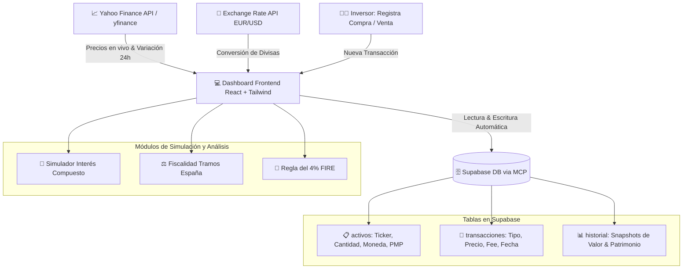

# 📈 Tu Portfolio de Activos en Tiempo Real: Dashboard Financiero Integral

> **Comunidad:** Vibe Coding (Skool - IA Masters Automations)  
> **API de Mercado:** [yfinance en GitHub](https://github.com/ranaroussi/yfinance) | [`YFinance-Guia-Maestra-Datos-Financieros.html`](./YFinance-Guia-Maestra-Datos-Financieros.html)  
> **Aprovisionamiento de Datos:** Supabase Cloud vía Supabase MCP  

---

## 🎯 Objetivo de la Clase

Construir un **dashboard financiero profesional y automatizado** para unificar y controlar todo el patrimonio familiar o personal (acciones, criptomonedas, fondos indexados, cuentas bancarias en distintas divisas). 

El sistema resuelve la dispersión de activos en múltiples brokers y plataformas, automatizando:
1. La consulta de cotizaciones en tiempo real mediante **Yahoo Finance**.
2. La conversión automática de divisas (**EUR/USD**) con normalización del patrimonio total.
3. El cálculo dinámico del **Precio Medio Ponderado (PMP)**, variación 24h y **P&L (Profit & Loss)** acumulado e histórico.
4. El registro inmutable de compras/ventas sincronizadas con **Supabase**.
5. Módulos avanzados de proyección: **Simulador de Interés Compuesto**, **Estimador de Fiscalidad por Tramos en España** y **Regla del 4% para Independencia Financiera (FIRE)**.

---

## 🚀 Qué te Llevas de esta Clase

* **Visión Patrimonial 360°:** Todo tu capital unificado en una sola pantalla sin depender de hojas de cálculo desactualizadas.
* **Cero Trabajo Manual de Actualización:** Precios, divisas y variaciones se refrescan de forma automática.
* **Precisión Contable:** Registro de transacciones con recálculo de precio medio ponderado y comisiones.
* **Aprovisionamiento Asistido con Supabase MCP:** Creación y mantenimiento de las tablas `activos`, `historial` y `transacciones` sin tocar la interfaz web de base de datos.
* **Planificación Financiera a Largo Plazo:**
  - Simulador de interés compuesto con aportaciones periódicas y escenarios (conservador, realista, optimista).
  - Cálculo de retención fiscal estimada sobre plusvalías según los tramos del IRPF (Ahorro) en España.
  - Regla del 4% (Trinity Study) para proyectar la renta mensual sostenible y los años de cobertura financiera.
* **Ingeniería Inversa:** Metodología y prompt maestro para clonar, adaptar o extender cualquier dashboard de finanzas.

---

## 🧩 Arquitectura del Sistema Financiero



---

## ⚙️ Estructura de Tablas en Supabase

### 1. Tabla `activos`
Almacena la posición consolidada de cada instrumento financiero:
```sql
CREATE TABLE activos (
  id UUID PRIMARY KEY DEFAULT gen_random_uuid(),
  ticker TEXT NOT NULL UNIQUE,
  nombre TEXT NOT NULL,
  categoria TEXT CHECK (categoria IN ('Acciones', 'Cripto', 'Fondos', 'Efectivo')),
  cantidad NUMERIC NOT NULL DEFAULT 0,
  moneda TEXT CHECK (moneda IN ('EUR', 'USD')),
  precio_medio_compra NUMERIC NOT NULL DEFAULT 0,
  updated_at TIMESTAMP WITH TIME ZONE DEFAULT NOW()
);
```

### 2. Tabla `transacciones`
Historial de compras, ventas y aportaciones de capital:
```sql
CREATE TABLE transacciones (
  id UUID PRIMARY KEY DEFAULT gen_random_uuid(),
  activo_id UUID REFERENCES activos(id) ON DELETE CASCADE,
  tipo TEXT CHECK (tipo IN ('COMPRA', 'VENTA', 'DEPOSITO', 'RETIRO')),
  cantidad NUMERIC NOT NULL,
  precio_unitario NUMERIC NOT NULL,
  comision NUMERIC DEFAULT 0,
  moneda TEXT CHECK (moneda IN ('EUR', 'USD')),
  fecha TIMESTAMP WITH TIME ZONE DEFAULT NOW()
);
```

### 3. Tabla `historial`
Snapshots periódicos para generar gráficas de evolución temporal:
```sql
CREATE TABLE historial (
  id UUID PRIMARY KEY DEFAULT gen_random_uuid(),
  patrimonio_total_usd NUMERIC NOT NULL,
  patrimonio_total_eur NUMERIC NOT NULL,
  beneficio_acumulado_usd NUMERIC NOT NULL,
  fecha TIMESTAMP WITH TIME ZONE DEFAULT NOW()
);
```

---

## 🧮 Módulos y Fórmulas Matemáticas

### 1. Precio Medio Ponderado (PMP)
Cuando se ejecuta una nueva compra de $N$ acciones a precio $P$:
$$PMP_{nuevo} = \frac{(Cantidad_{actual} \times PMP_{actual}) + (Cantidad_{nueva} \times Precio_{nuevo}) + Comisiones}{Cantidad_{actual} + Cantidad_{nueva}}$$

### 2. Simulación de Interés Compuesto
$$Valor\ Final = P \times (1 + r)^t + PMT \times \frac{(1 + r)^t - 1}{r}$$
* $P$: Capital inicial
* $PMT$: Aportación periódica mensual
* $r$: Tasa de rentabilidad anual (dividida por 12)
* $t$: Meses totales de inversión

### 3. Tramos IRPF del Ahorro (España)
| Base Liquidable del Ahorro | Tipo Impositivo |
| :--- | :--- |
| Hasta 6.000 € | **19%** |
| De 6.000 € a 50.000 € | **21%** |
| De 50.000 € a 200.000 € | **23%** |
| De 200.000 € a 300.000 € | **27%** |
| Más de 300.000 € | **28%** |

### 4. Regla del 4% (Independencia Financiera - FIRE)
* **Capital Necesario para Jubilación:** $Gastos\ Anuales \times 25$
* **Renta Anual Sostenible:** $Patrimonio\ Total \times 0.04$
* **Renta Mensual Neta Estimada:** $\frac{Renta\ Anual \times (1 - Retención\ Media)}{12}$

---

## 🧠 Consejos y Buenas Prácticas

1. **Automatización Obligatoria de Precios:** Introducir precios a mano genera desfase temporal y conduce a malas decisiones en momentos de volatilidad.
2. **Normalización de Divisas:** Mantener siempre un contravalor de referencia en una moneda base (USD o EUR) para evitar distorsiones por el tipo de cambio.
3. **Registro Inmutable de Transacciones:** Nunca edites la cantidad de un activo a mano sin registrar la transacción que lo originó; de lo contrario, el cálculo de plusvalías fiscales será incorrecto.
4. **Ingeniería Inversa:** Si ves un dashboard financiero de referencia que te gusta, extrae sus KPIs y deja que Antigravity lo replique estructurando el esquema en Supabase.

---

## 📂 Recursos y Enlaces Relacionados

* **📘 Guía Maestra yfinance:** [`YFinance-Guia-Maestra-Datos-Financieros.html`](./YFinance-Guia-Maestra-Datos-Financieros.html) \| [`YFinance-Guia-Maestra-Datos-Financieros.md`](./YFinance-Guia-Maestra-Datos-Financieros.md)
* **🌟 Catálogo Completo AAS (2,474+ Skills):** [`Agentic-Awesome-Skills-Guia-Completa.html`](./Agentic-Awesome-Skills-Guia-Completa.html)
* **⚡ Hub Central de Recursos:** [`index.html`](./index.html) \| [`README.html`](./README.html)
* **📦 Repositorio yfinance:** [https://github.com/ranaroussi/yfinance](https://github.com/ranaroussi/yfinance)
