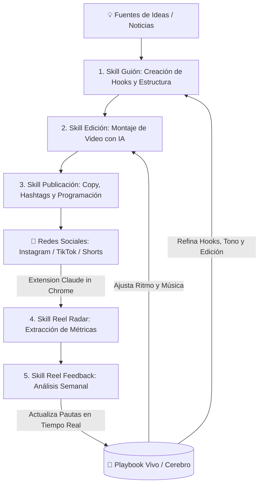

# 👨‍💻 Reel Engine: Tu Propio Sistema de Reels que Aprende con IA

> **Fecha de la Clase:** 23 Julio 2026  
> **Comunidad:** Vibe Coding (Skool - IA Masters Automations)  
> **Grabación Contexto Pipeline:** [Editar Reels con Claude — Pipeline Completo](https://www.skool.com/ia-masters-automations/classroom/56b4a809?md=36ce41b000194715b4bef11fe82596a3)  
> **Grabación Primera Parte:** [Monta tu Editor de Videos con IA](https://www.skool.com/ia-masters-automations/classroom/b5848fd4?md=c7e93f2569704765a55647f015994ea8)  
> **Archivos del Proyecto:** [`forja-reel-engine.skill`](./forja-reel-engine.skill) | [`forja-reel.skill`](./forja-reel.skill) | [`forja-reel-engine-explicacion.html`](./forja-reel-engine-explicacion.html) | [`forja-reel-explicacion.html`](./forja-reel-explicacion.html) | [`reel-edita-explicacion.html`](./reel-edita-explicacion.html)

---

## 🎯 Objetivo de la Clase

Presentar y configurar **`/forja-reel-engine`**: la **meta-skill** que monta tu sistema completo de reels con Inteligencia Artificial. No es un editor de video aislado; es un **motor compuesto por 5 skills integradas** en un solo bucle continuo que se retroalimenta automáticamente y aprende de lo que realmente funciona en tu propia cuenta.

---

## 🚀 Qué te Llevas de esta Clase

1. **Meta-Skill `/forja-reel-engine` lista para instalar:** Te entrevista sobre tu nicho, tu tono de voz y tu frecuencia de publicación para generarte una skill final 100% personalizada.
2. **El Bucle Completo de 5 Skills:**
   - ✍️ **Guión:** Generación desde noticias del sector, transcripciones de videos o ideas en bruto.
   - 🎬 **Edición de Video:** Ensamblaje automatizado, cortes de silencios, b-rolls, captions animados y música.
   - 📢 **Publicación:** Generación de copies optimizados, hashtags estratégicos y programación (conectable con GoHighLevel / Make / n8n).
   - 📡 **Reel Radar:** Lectura automática de métricas reales (alcance, retención, guardados, comentarios).
   - 🔄 **Reel Feedback:** Auditoría semanal de rendimiento que sintetiza aprendizajes.
3. **El "Cerebro" (Playbook Vivo):** Un manual de operaciones que se actualiza autónomamente. Si detecta que los ganchos confrontativos generan 3x más retención, fuerza los próximos guiones y ediciones en esa línea.
4. **Automatización Semanal:** Rutina de análisis periódica (ej. cada lunes) para iterar sin esfuerzo manual.

---

## 🧩 Arquitectura del Reel Engine (5 Skills en Bucle)

---

## ⚙️ Las 4 Fases de la Meta-Skill `/forja-reel-engine`

1. **Fase 1: Entrevista de Personalización:**  
   La ejecutas en tu terminal o agente y te pregunta: tu nicho, tono de voz, plataformas destino, frecuencia de subida y tus fuentes de inspiración.
2. **Fase 2: Auditoría del Entorno:**  
   Comprueba si tienes instalado el motor de edición (`/forja-reel` o pipeline de edición previa) y las dependencias necesarias.
3. **Fase 3: Generación de las 4 Sub-skills y el Cerebro:**  
   Crea y enlaza las skills de Guión, Publicación, Reel Radar y Reel Feedback junto con el documento `playbook.md` vivo.
4. **Fase 4: Despliegue de tu Comando Maestro:**  
   Te entrega tu skill unificada (ej. `/reel-completo`), lista para generar, editar y medir tus publicaciones.

---

## 🛠️ Requisitos Previos

* **Editor de Vídeo previo montado:** Debes tener configurada la skill de edición de la clase anterior ([`forja-reel.skill`](./forja-reel.skill) / [`reel-edita-explicacion.html`](./reel-edita-explicacion.html)).
* **Instagram logueado en Chrome:** Con la extensión *Claude in Chrome* o sesión activa para que el Reel Radar pueda leer tus insights de métricas.

---

## 🧠 Aprendizajes Clave

* **Publicar sin bucle no genera tracción:** Lo que escala tu cuenta es el bucle `Idea ➔ Guión ➔ Edición ➔ Publicar ➔ Medir ➔ Aprender ➔ Repetir`.
* **El Playbook Vivo es tu mayor activo:** Con cada semana que pasa, el sistema se vuelve más inteligente y afina el estilo específico que le gusta a tu audiencia.

---

## 📂 Recursos Disponibles

* **🌐 Presentación Interactiva del Engine:** [`forja-reel-engine-explicacion.html`](./forja-reel-engine-explicacion.html)
* **🌐 Guía del Editor de Video (Parte 1):** [`reel-edita-explicacion.html`](./reel-edita-explicacion.html)
* **🌐 Explicación Forja Reel:** [`forja-reel-explicacion.html`](./forja-reel-explicacion.html)
* **📦 MetaSkill Reel Engine:** [`forja-reel-engine.skill`](./forja-reel-engine.skill)
* **📦 Skill Editor de Video:** [`forja-reel.skill`](./forja-reel.skill)
* **🎥 Grabación Skool Pipeline:** [Ver en Skool](https://www.skool.com/ia-masters-automations/classroom/56b4a809?md=36ce41b000194715b4bef11fe82596a3)
* **🎥 Grabación Skool Monta tu Editor:** [Ver en Skool](https://www.skool.com/ia-masters-automations/classroom/b5848fd4?md=c7e93f2569704765a55647f015994ea8)
