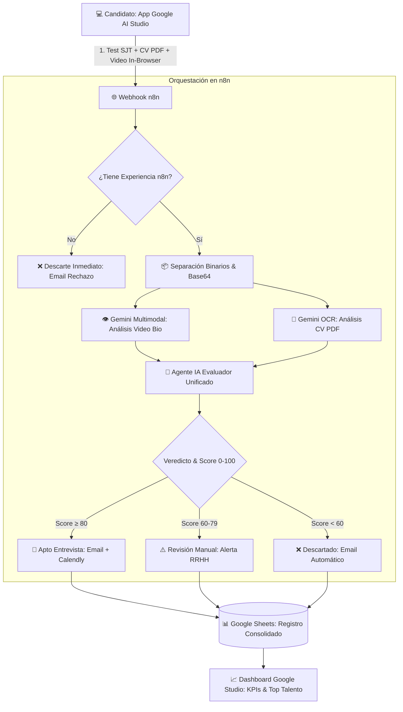

# 🎯 El Sistema Definitivo para Filtrar Talento (Google AI Studio + n8n + Gemini)

> **Comunidad:** Vibe Coding (Skool - IA Masters Automations)  
> **App Google AI Studio:** [FYZON Recruitment Drive App](https://aistudio.google.com/apps/drive/15JQf9xwEKqhqY_iaiIL0g1Fxgxq-0qj2?showPreview=true&showAssistant=true) (`15JQf9xwEKqhqY_iaiIL0g1Fxgxq-0qj2`)  
> **Documento de la App Frontend:** [`FYZON-Recruitment-n8n-Specialist.html`](./FYZON-Recruitment-n8n-Specialist.html) \| [`FYZON-Recruitment-n8n-Specialist.md`](./FYZON-Recruitment-n8n-Specialist.md)  

---

## 🎯 Objetivo de la Clase

Construir un **sistema de reclutamiento y triaje de talento avanzado y 100% automatizado** combinando **Google AI Studio (Frontend interactivo con test y video-pitch)** con un **workflow orquestador en n8n** potenciado por **Google Gemini Multimodal**.

El sistema evalúa candidatos de forma inteligente, realiza OCR sobre currículums en PDF, analiza la comunicación no verbal y coherencia en video, puntúa técnicamente (0–100) y clasifica automáticamente a los aspirantes sin intervención humana.

---

## 🚀 Qué te Llevas de esta Clase

1. **Proceso de Reclutamiento Diferencial:** Una experiencia interactiva tipo embudo (preguntas situacionales con temporizador + grabación de video in-browser) que causa un impacto premium en el candidato.
2. **Primer Filtro Inmediato:** Descarte automático de candidatos que no cumplan requisitos mínimos (ej: experiencia real demostrada en n8n).
3. **Procesamiento Multimodal en Base64:** Separación de binarios (CV en PDF y Video en WebM/MP4) para análisis masivo mediante Gemini 1.5/2.0 Flash y Pro.
4. **Agente Evaluador con Rúbrica Técnica:**
   - Análisis de claridad, soltura y actitud en video.
   - Clasificación de seniority técnica (Junior, Intermedio, Senior) a partir del CV.
   - Puntuación objetiva ponderada (0–100), razonamiento argumentado y tags de habilidades.
5. **Ruteo y Toma de Decisiones:**
   - **`Apto para Entrevista` (Score ≥ 80):** Email de felicitación + enlace de Calendly.
   - **`Revisión Manual` (Score 60–79):** Notificación interna al equipo de RRHH.
   - **`Rechazado` (Score < 60):** Email educado y automático de agradecimiento con feedback.
6. **Sincronización Total & Dashboard:** Registro consolidado en Google Sheets y visualización de métricas en Google AI Studio.

---

## 🧩 Arquitectura End-to-End del Sistema



---

## ⚙️ Las 8 Fases del Flujo de Automatización

### 1. Formulario Dinámico en Google AI Studio
* Interfaz React + TypeScript con temporizador de 45 segundos por pregunta.
* Carga de CV en PDF.
* Grabador de video con API nativa del navegador (`MediaRecorder`) con cuenta atrás de 60 segundos.

### 2. Disparo del Webhook
* Envío de payload JSON con respuestas estructuradas y binarios codificados en Base64.

### 3. Filtro Duro Inicial (Fast-Fail)
* Comprobación booleana de experiencia previa. Si es negativa, se detiene el flujo para ahorrar tokens de análisis multimodal.

### 4. Procesamiento de Binarios en n8n
* Conversión segura de buffer a formato compatible con la API de Google Gemini (multimodal inline data).

### 5. Análisis Multimodal de Video con Gemini
* Evaluación de:
  - Expresión oral y coherencia técnica.
  - Capacidad de síntesis al explicar su experiencia.
  - Actitud, entusiasmo y resolución de problemas.

### 6. Análisis Estructurado de CV
* Extracción de tecnologías clave, años de experiencia real en producción, certificaciones y consistencia cronológica.

### 7. Agente IA Evaluador & Veredicto
* Prompt estructurado de evaluación que combina los resultados del test, el CV y el video:
  ```json
  {
    "candidate_name": "Nombre",
    "final_score": 88,
    "verdict": "INTERVIEW",
    "seniority_level": "Senior",
    "reasoning": "Demuestra dominio sólido de n8n, manejo de errores y excelente comunicación oral.",
    "skills_tags": ["n8n", "PostgreSQL", "Gemini", "Docker", "Webhooks"]
  }
  ```

### 8. Ruteo y Dashboard
* Bifurcación automática por nodo Switch.
* Envío de emails mediante Gmail o Resend.
* Append en Google Sheets con fila formateada para visualización en el dashboard.

---

## 🧠 Consejos y Reglas de Oro

1. **Filtrar Pronto Ahorra Recursos:** Descarta candidatos no válidos antes de llamar a modelos de visión o video multimodal.
2. **El Video Revela lo que el CV Oculta:** Un video de 60 segundos evidencia la capacidad real de comunicación y dominio situacional mucho mejor que un documento de texto.
3. **Formato Base64 para Gemini:** Enviar los binarios inline data en Base64 garantiza compatibilidad y evita errores de almacenamiento temporal.
4. **Prompts con Rúbrica Explícita:** Definir escalas de 0 a 100 con criterios objetivos evita el sesgo y la variabilidad de notas entre candidatos.

---

## 📂 Recursos y Enlaces Relacionados

* **💻 App Frontend Google AI Studio:** [`FYZON-Recruitment-n8n-Specialist.html`](./FYZON-Recruitment-n8n-Specialist.html) \| [`FYZON-Recruitment-n8n-Specialist.md`](./FYZON-Recruitment-n8n-Specialist.md)
* **👨‍🍳 Camarero Virtual & Cocina (Google AI Studio):** [`Camarero-Virtual-Cocina-Tiempo-Real.html`](./Camarero-Virtual-Cocina-Tiempo-Real.html)
* **⚡ Hub Central de Recursos:** [`index.html`](./index.html) \| [`README.html`](./README.html)
* **🌐 Google AI Studio Drive:** [https://aistudio.google.com/apps/drive/15JQf9xwEKqhqY_iaiIL0g1Fxgxq-0qj2](https://aistudio.google.com/apps/drive/15JQf9xwEKqhqY_iaiIL0g1Fxgxq-0qj2?showPreview=true&showAssistant=true)
